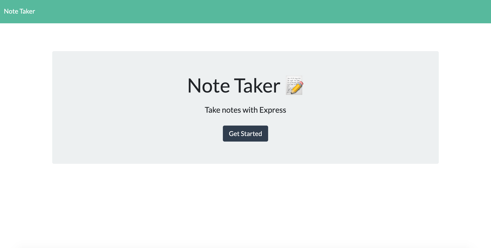
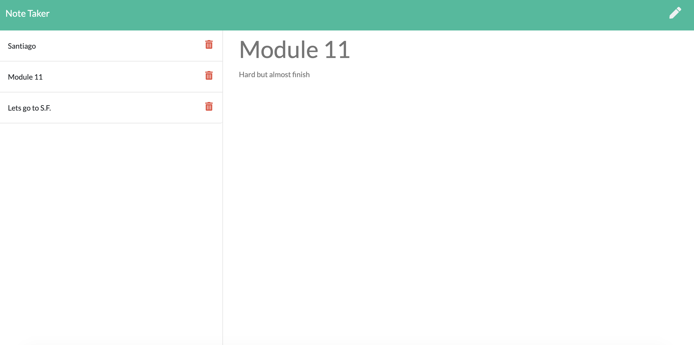
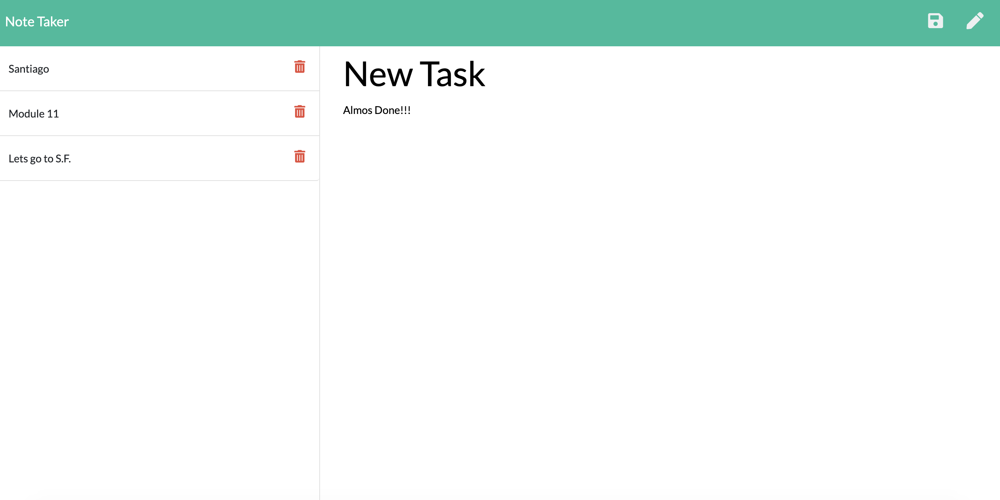
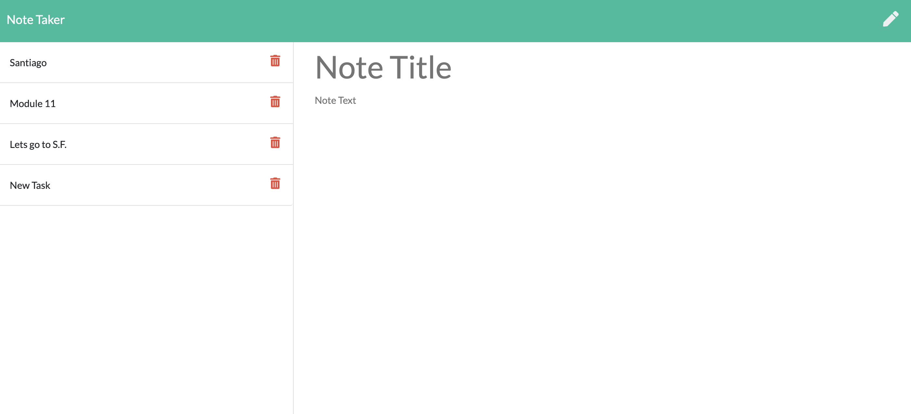

# Note Taker
Biuld by 
Mario Viana

## Main Screen

## Screen Note Taker

## Add a new task!!!

## Task Added

# Programming Languages!!!
* JavaScript
* Node JS
* Express JS
* HTML
* CSS
* BootStrap

## HEROKU

https://notetaker-mario-viana.herokuapp.com/

## Description

Our note-taker program was created for those people who like to keep an order in their daily activities, people can add and delete their tasks. to run our program we will use the command "npm start" to open our local host, after this in our browser we will have to write http: // localhost: 3007 in the navigator bar so that we can see our program or you can also click through the link that we provide in Heroku.
